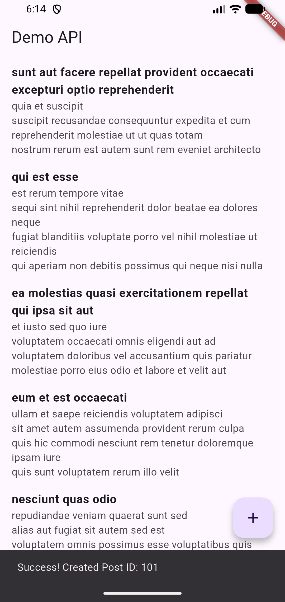

#This is a Flutter application that demonstrates API integration using the JSONPlaceholder REST API.
#The app fetches a list of posts from a remote server and displays them in a scrollable list.
#Users can also create a new post by sending data to the API.

#Features

#Fetches posts from a remote REST API

#Displays posts in a list view

#Sends (POST) data to the API

#Uses FutureBuilder for asynchronous data handling

#Clean separation of concerns using Repository pattern

